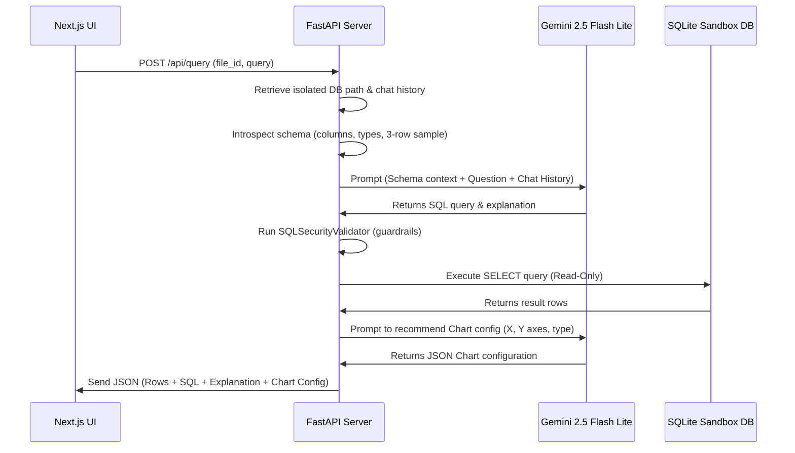

# HyperMindZ Analytics Engine - Technical Documentation 📑

This document provides a detailed breakdown of the technical decisions, architecture, AI-assisted development workflow, trade-offs, and presentation structure for the HyperMindZ Take-Home Assignment.

---

## 🏛️ 1. Architecture Decisions

### Why This Stack?
1.  **FastAPI (Backend)**: We selected FastAPI for its high-performance asynchronous execution, automatic Swagger/OpenAPI documentation generation, and strict typing with Pydantic. It allows for fast iteration and bridges easily with Python's analytical ecosystem.
2.  **Next.js 16 / React 19 (Frontend)**: Next.js is the modern standard for React applications, offering fast routing and clean layouts. React 19 provides high performance, and Next.js allows us to decouple the client-side dashboard from the analytical engine.
3.  **Tailwind CSS v4 & Lucide React**: Tailwind CSS v4 provides a utility-first styling system with native support for CSS variables and modern animations, allowing us to build a gorgeous, premium, glassmorphic UI.
4.  **Google Gemini 2.5 Flash Lite**: Selected as the primary LLM because of its exceptionally low latency, high token rate limits on the free tier, and strong reasoning capabilities for SQL generation.
5.  **SQLite (Storage & Isolation)**: Rather than using a shared Postgres cluster, SQLite was selected to implement physical sandboxing of user files. 

---

### How the NL-to-SQL Pipeline Works

The execution flow uses LangChain's SQL database agent tools to generate and execute statements securely:

1.  **Schema Introspection**: On receiving a user question, the backend queries the database schema using SQLite's `PRAGMA table_info` and extracts a 3-row sample from the table. This is injected dynamically into the LLM system prompt so the LLM is fully schema-aware and doesn't hallucinate column names.
2.  **Prompt Design**: The system prompt instructs the model to translate the natural language query into a valid, optimized SQLite query. It also feeds the last 5 turns of conversation context (stored in the central database's `chat_history` table) so the model can resolve follow-up filters (e.g., "now filter that by region = West").
3.  **SQL Query Validation (Security Guardrails)**:
    *   **Keyword Blacklist**: The generated SQL is checked programmatically by our custom `SQLSecurityValidator`. It asserts that the SQL statement does *not* contain forbidden keywords like `DROP`, `DELETE`, `UPDATE`, `INSERT`, `ALTER`, `CREATE`, `TRUNCATE`, `REPLACE`, `ATTACH`, or `DETACH`.
    *   **Command Checking**: The query must explicitly start with `SELECT` or `WITH`.
    *   **Stacked Statement Block**: Semicolons are analyzed. If there are multiple SQL statements separated by semicolons, the execution is blocked.
    *   **Connection Mode**: SQLite connections are opened using read-only configurations.
4.  **Visualization Heuristics**: The SQL statement and query text are passed through a second minor Gemini LLM chain. This chain evaluates the columns and results to decide if a chart is appropriate, returning a JSON configuration specifying `chart_type` (bar, line, pie, area, none) and recommending keys for the X and Y axes.

---

### Database Schema and Rationale

We run a **two-tier database architecture** to enforce data security and multi-tenant isolation:

#### A. Central Metadata Database (`backend/metadata.db`)
Stores global session and metadata records.
*   **`users`**: Handles auth (`id`, `email`, `password_hash`, `active_token`).
*   **`files`**: Connects files to users (`id`, `user_id`, `file_name`, `table_name`, `row_count`, `columns_json`, `sample_rows_json`).
*   **`query_history`**: Persistent log of run queries (`id`, `user_id`, `file_id`, `question`, `sql_query`, `explanation`, `visualization_config_json`).
*   **`chat_history`**: Stores multi-turn conversation memory (`id`, `user_id`, `file_id`, `role`, `content`).

#### B. Isolated File Databases (`backend/db_<user_id>_<file_id>.sqlite`)
*   **Rationale**: By provisioning a separate, physically distinct SQLite database file for every single file upload, we ensure complete data isolation. User A's analytical queries cannot reference, sub-select, or touch User B's tables under any circumstances. If a user deletes a file, we perform a clean, physical OS-level file deletion, guaranteeing zero data remnants.

---

### Authentication Approach
*   **Single-Device JWT Session Tracking**: Standard email/password registration and login routes.
*   Once logged in, the server generates a JSON Web Token (JWT) signed with a secure server key.
*   The token is stored in the user's central profile table as an `active_token`. This restricts active sessions to a single device (logging in elsewhere invalidates the prior session).
*   All file management and query routes require the token to be sent via the `Authorization: Bearer <token>` header.

---

## 🛠️ 2. AI Tool Usage & Reflections

### AI Tools Utilized
During local development, we utilized **Cursor** and **Claude Code** for structural scaffolding, prompt optimization, React state coordination, and writing unit test suites.

### Examples of Effective AI Assistance
*   **Recharts Integration**: AI was highly effective in drafting components that dynamically adapt to varying data shapes and key formats returned by the backend.
*   **Unit & Endpoint Testing**: AI scaffolded the initial `FastAPI TestClient` mocks and parameterized assertions, accelerating our testing cycles.

### Decisions Overriding AI Suggestions
1.  **Bcrypt Import Conflict**: AI recommended utilizing `passlib.context.CryptContext` with the `bcrypt` hashing scheme. However, in modern Python (3.12+), `passlib` is deprecated and crashes with modern versions of the `bcrypt` library (greater than v4.0.0). We overrode this advice and implemented direct imports of `bcrypt` using standard bytes encoding, solving the runtime crashes.
2.  **Separate Physical Databases**: AI models commonly suggest creating a single, massive PostgreSQL or SQLite database and adding a `user_id` column to every CSV table. We overrode this to use physically isolated SQLite files. This prevents LLM prompt-leakage attacks (where a user crafts a prompt asking the SQL Agent to select from other tenant partition IDs) and simplifies compliance cleanup.

---

## ⚖️ 3. Trade-offs Made

### Prioritizations Given Time Constraints
1.  **Tabular SQL Execution Quality**: We prioritized a rock-solid, secure SQLite sandboxing model and conversational context over RAG documents. 
2.  **Comprehensive UX/UI**: We focused heavily on loading states, responsive Recharts plotting, and a complete database profiling workspace (catalog metadata, sample grids) to deliver a production-grade experience.

### What We Would Improve with More Time
*   **Schema Indexing**: Automatically analyze column cardinality on ingestion and create indexes on date, integer, and high-frequency category columns to optimize query speeds.
*   **Conversational Multi-File Joins**: Allow the SQL agent to join multiple CSV files belonging to the same user in a single query by binding multiple tables into a single database.

### Handling Larger Datasets (1M+ rows / 1GB+ files)
If scaling to massive enterprise files, SQLite and in-memory dataframes will hit memory/performance thresholds. The scaling architecture changes would be:
1.  **Migrate to DuckDB**: Replace SQLite with DuckDB on the backend. DuckDB is a columnar analytical engine designed for high-performance aggregations on local disks. It can query massive CSV/Parquet files in milliseconds with extremely low memory footprints.
2.  **Paginated Grid Streaming**: Instead of sending the full query result JSON array (which freezes the browser for large datasets), stream results in batches (e.g. 50 rows per page) and restrict Recharts visualization rendering to pre-aggregated category sums.
3.  **Asynchronous Ingestion**: Large uploads must run on background workers (e.g. Celery / Redis) with progress-bar status tracking to keep the API server responsive.

---

## 🎤 4. Walkthrough Presentation Structure (30-Minute Guide)

If presenting this work live to the HyperMindZ team, follow this structured timeline to maximize impact:

### Part 1: Live Application Demonstration (12 Minutes)
*   **The Interface (3 Mins)**: Log in with the pre-seeded account `demo@hypermindz.com`, and walk through the Dashboard, Data Catalog, Settings, and AI Playground.
*   **Catalog Upload & Profiling (3 Mins)**: Drag and drop a new CSV. Show the immediate columns metadata, row counting, and sample grid loading.
*   **Playground Queries & Dynamic Charts (6 Mins)**:
    *   Show a simple aggregation: *"What is the total revenue by product category?"* (point out the SQL log transparency and the generated Bar Chart).
    *   Show a complex filter: *"Show all orders over $300 that came from mobile users"*.
    *   Show trend line over time: *"Show the monthly revenue trend"*.
    *   Show follow-up context: *"Filter that for West region"* (demonstrating how the agent holds conversational memory).

### Part 2: Architecture & Code Walkthrough (12 Minutes)
*   **Physical Isolation Concept (4 Mins)**: Open [db_manager.py](file:///Users/yashmeetpunjabi/hypermindz-analytics-engine/backend/db_manager.py) and [utils.py](file:///Users/yashmeetpunjabi/hypermindz-analytics-engine/backend/utils.py#L45-L65). Explain the rationale behind generating a separate physical SQLite database file for each upload.
*   **SQL Generation & Security Pipeline (4 Mins)**: Open [query_routes.py](file:///Users/yashmeetpunjabi/hypermindz-analytics-engine/backend/routers/query_routes.py#L44-L157). Explain how the LangChain agent is invoked with schema context and show how `SQLSecurityValidator` acts as a guardrail against dangerous statement injections.
*   **Frontend Dynamic Chart Mapping (4 Mins)**: Walk through how the client app parses the recommended `visualization_config` from the API and maps results to Recharts components in `Playground.tsx`.

### Part 3: QA and Scaling Discussion (6 Minutes)
*   Highlight the **SaaS scaling roadmap** (transitioning from SQLite to DuckDB, caching strategies, and pagination streaming for 1M+ rows).
*   Address questions about LangChain prompt design, auth token invalidation, and custom UI components.
