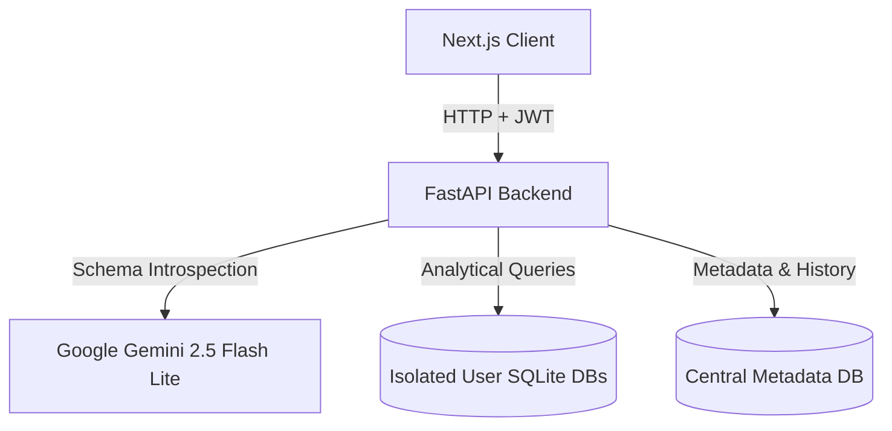
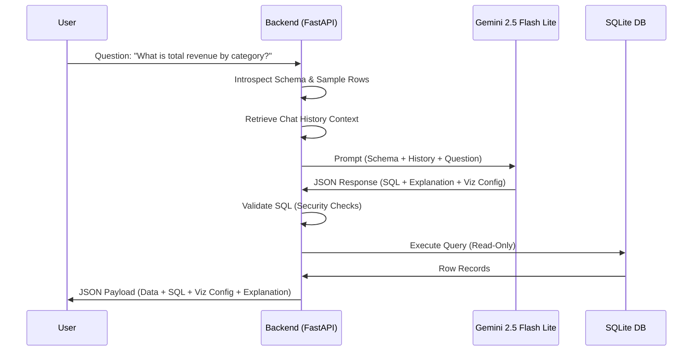

# HyperMindZ Analytics Engine 📊

An intelligent, secure, end-to-end GenAI application that lets users upload CSV files, automatically profile their datasets, ask natural language questions in plain English, and receive accurate answers in the form of interactive tables, visual charts, and clear insights.

---

## 🚀 Live Demo & Deployment Information

- **Live Application URL**: [https://hypermindz-frontend.vercel.app/](https://hypermindz-frontend.vercel.app/)
- **Deployed Backend URL**: [https://hypermindz-backend-1.onrender.com/api](https://hypermindz-backend-1.onrender.com/api) (Render API URL)
- **Demo Credentials**:
  - **Email**: `demo@hypermindz.com`
  - **Password**: `password123` *(Automatically seeded with sample sales, marketing, and product engagement datasets)*

---

## 🛠️ Tech Stack & Architecture Overview

The system is split into a modular backend service and a reactive frontend client:



### 1. Backend: FastAPI (Python)
- **FastAPI**: Handles high-performance HTTP request-response cycles.
- **SQLite3**: Serves as both the central metadata/logging registry and the sandboxed user-file databases (physical data isolation).
- **Pandas**: Used for initial CSV ingestion, data type inference, column structure cleaning, and dataframe querying.
- **LangChain**: Employs the SQL Agent chain to read DB context and compile natural language questions into SQLite statements.
- **Direct Bcrypt + PyJWT**: Enforces user authentication and token creation with zero external wrapper bugs.

### 2. Frontend: Next.js 16 (React 19 & Tailwind CSS v4)
- **Next.js App Router**: Provides high-efficiency hydration and component layouts.
- **Tailwind CSS v4**: Modern utility-first CSS engine with CSS variables, rich animations, and glassmorphic designs.
- **Recharts**: Generates highly interactive responsive SVG charts (Bar, Line, Pie, Area) with manual override switchers.
- **Lucide React**: Provides graphical iconography across catalog, console, and settings panels.

---

## 🗄️ Database Schema & Rationale

To enforce strict **multi-tenant data isolation**, we run a two-tier database architecture:

### A. Central Metadata Database (`backend/metadata.db`)
Tracks core SaaS states like authentication records, uploaded file references, and logging histories:
- **`users`**: `id` (UUID), `email` (Unique), `password_hash` (Bcrypt), `active_token` (JWT).
- **`files`**: `id` (UUID), `user_id` (FK), `file_name`, `table_name`, `row_count`, `columns_json`, `sample_rows_json`, `uploaded_at`.
- **`query_history`**: `id` (UUID), `user_id` (FK), `file_id` (FK), `question`, `sql_query`, `explanation`, `visualization_config_json`, `executed_at`.
- **`chat_history`**: `id` (UUID), `user_id` (FK), `file_id` (FK), `role` (user/model), `content`, `created_at`. *Used to maintain context for multi-turn conversations.*

### B. Isolated File Databases (`backend/db_<user_id>_<file_id>.sqlite`)
Whenever a user uploads a CSV:
1. A unique, sandboxed SQLite database file is created.
2. The CSV is parsed into a single table: `data_<file_id>`.
3. Columns are cleaned (lowercase, alphanumeric + underscores only) to prevent syntax errors.
4. **Rationale**: By isolating each upload into its own database file, we ensure that a query run against one CSV has zero physical access to other files uploaded by the same user or other users.

---

## 🧠 Natural Language to SQL (NL-to-SQL) Pipeline

The core pipeline transforms plain English questions into clean, secure SQL:



1. **Schema Introspection**: When a query comes in, the backend reads the table structure using `PRAGMA table_info` and queries a 3-row sample footprint.
2. **Stateful Chat Context**: The last 5 messages of the chat thread are formatted into the system prompt to let the LLM resolve follow-up phrases (e.g. "filter that for West").
3. **Structured Prompting**: The system prompt instructs Gemini to output a strict JSON scheme defining:
   - `sql_query`: The SQLite statement.
   - `explanation`: The plain English summary.
   - `visualization_recommended`: Boolean indicator.
   - `chart_type`, `x_axis_key`, `y_axis_key`: Plotting configurations.
4. **SQL Security & Guardrails**:
   - Stacked statements (semicolon injections) are blocked.
   - SQL keywords are checked against a forbidden list (`DROP`, `DELETE`, `UPDATE`, `INSERT`, `ALTER`, etc.).
   - The query *must* start with `SELECT` or `WITH`.
   - SQLite connections are configured for read-only analytical runs.

---

## 📈 5-10 Tested Sample Queries (To Try Immediately)

*Note: Log in to the seeded account `demo@hypermindz.com` (Password: `password123`) to try these queries on the default Sales Dataset:*

1. **"What is the total revenue by product category?"**
   - **Type**: Aggregation & Grouping
   - **Expected Result**: A bar chart and a summary table showing 5 categories (Electronics, Home & Kitchen, Clothing, Sports & Outdoors, Beauty) alongside their revenue.
2. **"Show all orders over $300 that came from mobile users"**
   - **Type**: Filtering
   - **Expected Result**: A detailed spreadsheet grid of orders where `revenue > 300` and `is_mobile = 1`.
3. **"Show top 5 products by sales revenue"**
   - **Type**: Sorting & Limiting
   - **Expected Result**: A table of 5 rows showing high-value products with the highest revenue.
4. **"What is the average quantity per order by region?"**
   - **Type**: Grouping & Averages
   - **Expected Result**: A table breakdown of 4 regions (North, South, East, West) with their average quantities.
5. **"Show the monthly revenue trend"**
   - **Type**: Trend Analysis
   - **Expected Result**: A line chart mapping dates (or year-month groupings) to total revenue.
6. **"Filter that for West region"** *(Type immediately after running query 5)*
   - **Type**: Conversational Follow-up
   - **Expected Result**: Refines the monthly trend chart to display calculations *only* where `region = 'West'`.

---

## ⚙️ Environment Variables & Configuration

Create a `.env` file in the `backend/` directory:

```env
GEMINI_API_KEY="your-google-gemini-api-key-here"
JWT_SECRET_KEY="your-jwt-signing-secret"
```

---

## 💻 Local Installation & Setup

### Prerequisites
- Python 3.10+
- Node.js 18+

### Step 1: Clone the Repository
```bash
git clone https://github.com/YashmeetSinghPunjabi/hypermindz-analytics-engine.git
cd hypermindz-analytics-engine
```

### Step 2: Configure the Backend
```bash
cd backend
# Create virtual environment
python -m venv venv
# Activate virtual environment
source venv/bin/activate  # On Windows use: .\venv\Scripts\activate

# Install dependencies
pip install -r requirements.txt

# Run backend unit tests to verify
python -m unittest test_backend.py test_routers.py

# Start uvicorn development server
uvicorn main:app --reload
```
The backend API documentation will be available at [http://127.0.0.1:8000/docs](http://127.0.0.1:8000/docs).

### Step 3: Configure the Frontend
```bash
cd ../frontend
# Install dependencies
npm install

# Run Next.js in development mode
npm run dev
```
Open [http://localhost:3000](http://localhost:3000) in your web browser.

---

## ☁️ Deployment Instructions

### Backend Deployment (Render)
1. Deployed as a Web Service on Render using the standard Python build.
2. Set Environment Variables: `GEMINI_API_KEY` and `JWT_SECRET_KEY`.
3. SQLite databases are stored in the `backend/` folder on disk.

### Frontend Deployment (Vercel)
1. Import the `frontend/` subdirectory in Vercel.
2. Configure build settings: Framework preset `Next.js`.
3. Set `NEXT_PUBLIC_API_URL` to point to your live backend endpoint.

---

## ✍️ AI-Assisted Development Reflections

### 1. AI Tools Utilized
During this project, we leveraged Gemini/Antigravity IDE coding assistance to scaffold endpoints, write React boilerplate, and design CSS transition states.

### 2. Examples of Effective AI Assistance
- **Next.js Recharts Layout**: AI assisted in configuring responsive containers and correctly matching object keys to chart coordinates.
- **SQL Sanitizer Regexes**: AI provided a clean regex tokenizer to strip punctuation and check for forbidden keywords without false-positive sub-string matches.

### 3. Decisions Overriding AI Suggestions
- **Direct Bcrypt Integration**: The AI suggested using `passlib.context.CryptContext` with `bcrypt`. In Python 3.12+, `passlib` throws an `AttributeError` with modern versions of the `bcrypt` library (greater than 4.0.0). We overrode this suggestion and implemented a direct import of `bcrypt` using standard bytes encoding, solving the import crashes.
- **Physical SQLite Separation**: AI models frequently suggest holding one single sqlite database and adding user partition IDs to columns. We overrode this and implemented distinct files: `db_<user>_<file>.sqlite`. This makes deleting a file a simple OS-level delete and prevents leaking data during complex SQL sub-select prompts.

---

## ⚖️ Trade-offs & Production Considerations

### 1. Current Trade-offs
- **In-Memory Query Results caching**: We load query results from SQLite directly into memory. For very large tables, this could lead to memory constraints.
- **Local DB Storage**: Currently, SQLite databases are stored on the local container volume. For horizontal autoscaling, a multi-tenant cloud data warehouse like Snowflake or PostgreSQL schemas should be used.

### 2. Scaling to Larger Datasets (1M+ rows)
If scaling to 1M+ rows / 1GB+ files:
- **DuckDB**: Replace SQLite with DuckDB on the backend. DuckDB is a columnar analytical engine designed specifically for fast aggregation queries over large CSVs/Parquet files directly on local disk, outperforming SQLite by 10x-100x.
- **Partitioning & Indexes**: Dynamically create indices on foreign keys, categories, and date columns during file upload profiling.
- **Pagination & Streaming**: Stream table result batches to the client rather than sending the full JSON array, and restrict visual chart plotting to the top 100 rows or query-aggregated categories.
